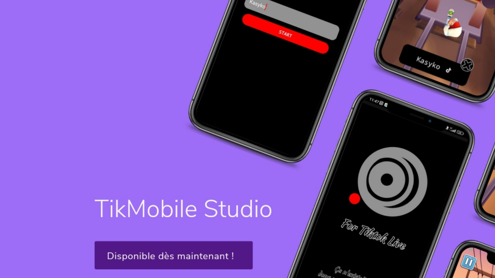
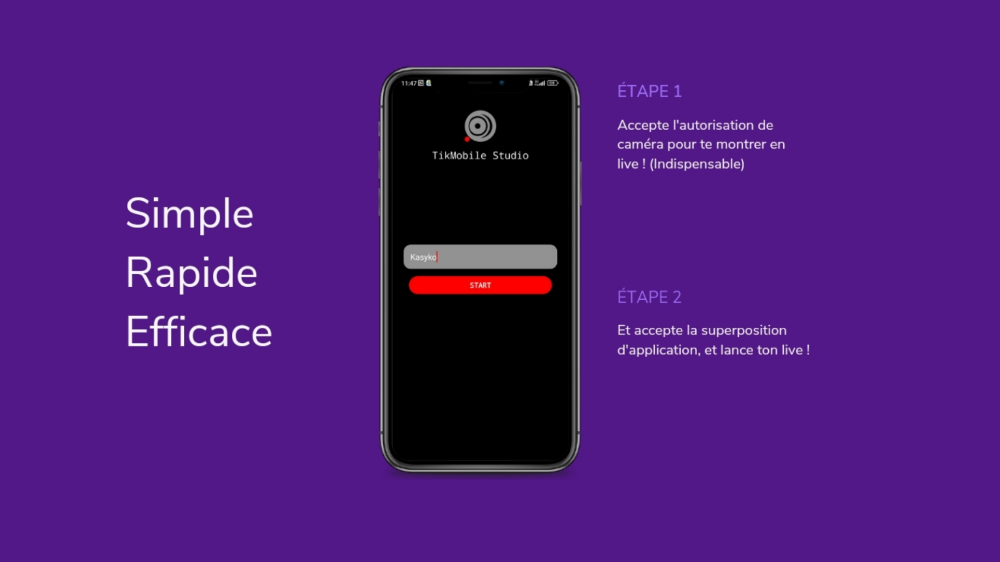
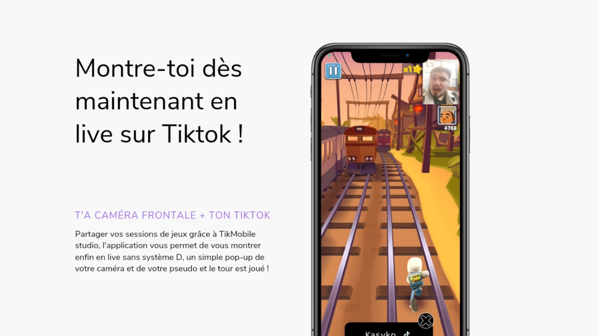

# 🎥 TikMobileStudio

  

---

## 🇫🇷 Présentation

**TikMobileStudio** est une application Android qui te permet de **faire des lives TikTok avec ta caméra frontale**, sans accessoires ou logiciels complexes.

---

## 🚀 Fonctionnalités principales

- 📸 Affiche un pop-up avec ta **caméra frontale** directement dans ton live TikTok
- 🪟 Ajoute ton **pseudo TikTok**
- 🎮 Idéal pour les sessions **gaming**, les lives détente ou créatifs
- ⚙️ Gère automatiquement les autorisations de **caméra** et de **superposition**
- 🧩 Utilisation simple, rapide, efficace

---

## 🧭 Comment ça marche ?

1. ✅ Accepte l’autorisation **caméra**
2. ✅ Autorise la **superposition d’application**
3. ✅ Lance ton live TikTok avec TikMobileStudio ouvert : tu es prêt !

---

## 📦 Télécharger l’APK

Installe l’application manuellement sur Android :

🔗 **[Télécharger TikMobileStudio 1.0 (APK)](https://github.com/kasybot/TikMobileStudio/blob/main/TikMobileStudio-1.0-release.apk?raw=true)**

---

## 🖼️ Aperçu de TikMobileStudio

<table>
  <tr>
    <td></td>
  </tr>
  <tr>
    <td></td>
  </tr>
  <tr>
    <td></td>
  </tr>
</table>

---

## ℹ️ À propos

- Version : **1.0**
- Auteur : **kasyko**
- Licence : [MIT](LICENSE)

> 💡 Ce projet est open-source. Forke-le, modifie-le, utilise-le librement !

---

## 🇬🇧 English Version

  

**TikMobileStudio** is a lightweight Android app that lets you **stream live on TikTok using your front camera**, without any external tools or complicated setup.

---

### Features
- Front camera popup during your TikTok Live
- Display your username
- Perfect for live gaming, chill sessions or creative content
- No TikTok account connection required
- No system overlay tricks, just works

---

### Download

🔗 **[Download TikMobileStudio 1.0 (APK)](https://github.com/kasybot/TikMobileStudio/blob/main/TikMobileStudio-1.0-release.apk?raw=true)**

---

### About

- Version: 1.0  
- Created by: **kasyko**  
- License: [MIT](LICENSE)

> This project is open-source – feel free to fork and improve it!
